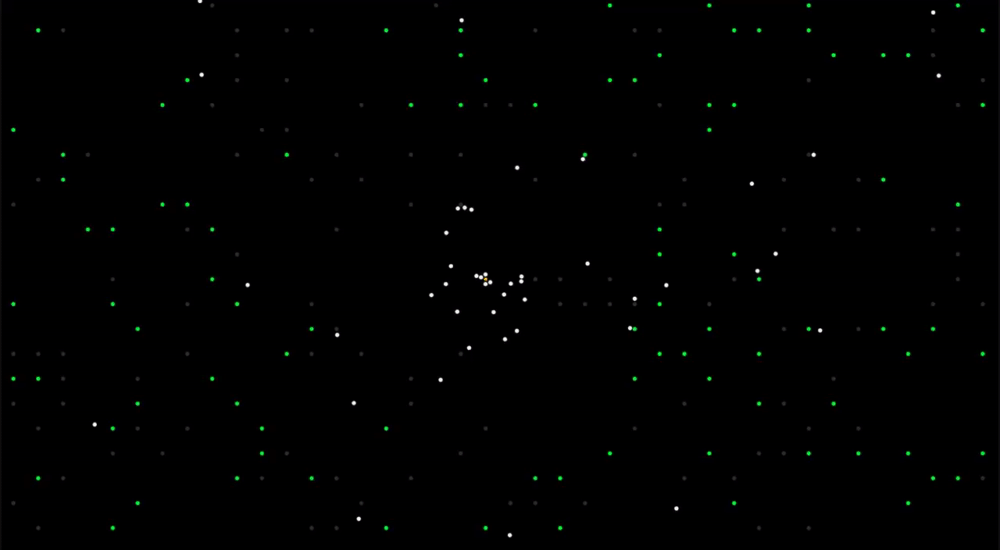

# Survivor
## Setup
1. Fork this repository and clone it
2. Install Unity `2019.3.0b9` (or any version greater than this should be fine)
3. Add the Unity project to Unity Hub
4. Launch the project

## Releases
See the [current releases](https://github.com/valkyrienyanko/Survivor/releases).

## Contributing
Please talk to me on discord at **valk#3277**.

See [CONTRIBUTORS.md](https://github.com/valkyrienyanko/Survivor/blob/master/CONTRIBUTORS.md) and the projects [issues](https://github.com/valkyrienyanko/Survivor/issues).

## Preview

